# Secure App Architecture — AWS Deployment

**Author:** Elizabeth Correa Suárez  

---

## Description

This project implements a secure web application deployed on AWS using two independent EC2 instances. The architecture separates concerns between a static frontend served by Apache and a RESTful API built with Spring Boot. Both servers are protected with TLS certificates issued by Let's Encrypt, ensuring encrypted communication across all layers of the system.

The application demonstrates the following security principles from the course:

- **Complete mediation:** every request to the API is checked for authentication and authorization.
- **Fail-safe defaults:** unauthenticated requests are rejected by default via Spring Security.
- **Least privilege:** the database user has access only to its own schema.
- **Open design:** standard, well-audited algorithms (BCrypt, TLS/ECDSA) are used instead of custom or obscure ones.

---

## Architecture Overview

```
User Browser
     |
     | HTTPS 443 (Let's Encrypt)
     v
+-------------------------+
|  EC2 ApacheWebServer    |
|  tdseelizaapache        |
|  .duckdns.org           |
|  Serves: index.html     |
|          style.css      |
|          app.js         |
+-------------------------+
     |
     | HTTPS 443 async fetch (JavaScript)
     v
+-------------------------+       +-------------------+
|  EC2 BackendServer      | ----> |  PostgreSQL 15    |
|  tdseelizabackend       |       |  DB: securedb     |
|  .duckdns.org           |       |  User: secureuser |
|  Spring Boot API        |       |  Passwords: BCrypt|
+-------------------------+       +-------------------+
```

**Flow:**
1. The browser navigates to the Apache domain over HTTPS and downloads the static HTML/CSS/JS client.
2. The JavaScript client makes asynchronous `fetch` calls over HTTPS to the Spring Boot API.
3. Spring Boot validates credentials against PostgreSQL, where passwords are stored as BCrypt hashes.

**AWS Infrastructure:**

| Resource | Value |
|---|---|
| ApacheWebServer IP | 18.213.84.35 (Elastic IP) |
| BackendServer IP | 34.228.106.245 (Elastic IP) |
| Apache domain | tdseelizaapache.duckdns.org |
| Backend domain | tdseelizabackend.duckdns.org |
| Instance type | t3.micro (both) |
| Region | us-east-1 |

---

## Project Structure

```
secure-app-architecture-aws/
├── src/
│   └── main/
│       ├── java/edu/eci/tdse/
│       │   ├── SecureAppApplication.java       # Spring Boot entry point
│       │   ├── controller/
│       │   │   ├── AuthController.java         # /api/auth/login, /api/auth/register
│       │   │   └── HelloController.java        # /api/hello (health check)
│       │   ├── model/
│       │   │   └── User.java                   # JPA entity
│       │   ├── repository/
│       │   │   └── UserRepository.java         # Spring Data JPA
│       │   ├── service/
│       │   │   └── UserService.java            # BCrypt hashing logic
│       │   └── security/
│       │       └── WebSecurityConfig.java      # Spring Security configuration
│       └── resources/
│           └── application.properties          # DB and server config
├── frontend/
│   ├── index.html                              # Login and register UI
│   ├── style.css                               # Styles
│   └── app.js                                 # Async fetch to Spring API
├── images/                                     # Screenshots for this README
├── pom.xml
└── README.md
```

---

## Security Implementation

### TLS — Let's Encrypt Certificates

Both servers use certificates issued by Let's Encrypt via Certbot. The certificates use ECDSA (SHA-256) and are valid for 90 days with automatic renewal configured.

- Apache: managed directly by Certbot with the `--apache` plugin.
- Spring Boot: certificate exported to PKCS12 format and loaded at startup via JVM arguments.

### Password Hashing — BCrypt

Passwords are never stored in plain text. On registration, the `UserService` encodes the raw password using Spring Security's `BCryptPasswordEncoder` before persisting the `User` entity. On login, `passwordEncoder.matches()` compares the submitted password against the stored hash without ever decoding it.

BCrypt was chosen over faster algorithms (SHA-256, MD5) because its computational cost factor makes brute-force attacks impractical. It also applies an automatic salt per password, preventing rainbow table attacks.

### Spring Security Configuration

The `WebSecurityConfig` class disables CSRF (acceptable for a stateless REST API) and explicitly permits only the `/api/auth/**` and `/api/hello` endpoints. All other routes require authentication by default.

### Database

PostgreSQL 15 is installed on the BackendServer instance. A dedicated database user (`secureuser`) owns only the `securedb` schema. The `pg_hba.conf` file was modified to use `md5` authentication for local TCP connections, replacing the default `ident` method which is incompatible with application-level users.

---

## Deployment Guide

### Prerequisites

- AWS account with two running EC2 instances (Amazon Linux 2023)
- A `.pem` key file for SSH access
- Two DuckDNS subdomains pointing to the Elastic IPs of each instance
- Java 21 and Maven installed locally

### Step 1 — Build the JAR

```bash
mvn clean package -DskipTests
```

### Step 2 — Configure the BackendServer

Connect via SSH:

```bash
ssh -i "AppServerKey.pem" ec2-user@34.228.106.245
```

Install Java 21 and PostgreSQL:

```bash
sudo dnf update -y
sudo dnf install -y java-21-amazon-corretto
sudo dnf install -y postgresql15-server
sudo postgresql-setup --initdb
sudo systemctl start postgresql
sudo systemctl enable postgresql
```

Create the database and user:

```bash
sudo -u postgres psql -c "CREATE USER secureuser WITH PASSWORD 'securepass';"
sudo -u postgres psql -c "CREATE DATABASE securedb OWNER secureuser;"
```

Edit `/var/lib/pgsql/data/pg_hba.conf` and change `ident` to `md5` for the two `host all all` entries:

```bash
sudo sed -i 's/host    all             all             127.0.0.1\/32            ident/host    all             all             127.0.0.1\/32            md5/' /var/lib/pgsql/data/pg_hba.conf
sudo sed -i 's/host    all             all             ::1\/128                 ident/host    all             all             ::1\/128                 md5/' /var/lib/pgsql/data/pg_hba.conf
sudo systemctl restart postgresql
```

Install Certbot and generate the certificate:

```bash
sudo dnf install -y certbot
sudo certbot certonly --standalone -d tdseelizabackend.duckdns.org
```

Export the certificate to PKCS12:

```bash
sudo openssl pkcs12 -export \
  -in /etc/letsencrypt/live/tdseelizabackend.duckdns.org/fullchain.pem \
  -inkey /etc/letsencrypt/live/tdseelizabackend.duckdns.org/privkey.pem \
  -out /home/ec2-user/keystore.p12 \
  -name tdseelizabackend \
  -password pass:securepass123
sudo chown ec2-user:ec2-user /home/ec2-user/keystore.p12
```

### Step 3 — Upload and run the JAR

From your local machine:

```bash
scp -i "AppServerKey.pem" target/SecureSpring-1.0-SNAPSHOT.jar ec2-user@34.228.106.245:/home/ec2-user/
```

On the BackendServer:

```bash
sudo nohup java -jar SecureSpring-1.0-SNAPSHOT.jar \
  --server.ssl.key-store=/home/ec2-user/keystore.p12 \
  --server.ssl.key-store-password=securepass123 \
  --server.ssl.key-store-type=PKCS12 \
  --server.ssl.key-alias=tdseelizabackend \
  --server.ssl.enabled=true \
  --server.port=443 > app.log 2>&1 &
```

Verify:

```bash
curl -k https://localhost:443/api/hello
```

### Step 4 — Configure the ApacheWebServer

Connect via SSH:

```bash
ssh -i "AppServerKey.pem" ec2-user@18.213.84.35
```

Create the VirtualHost configuration:

```bash
sudo nano /etc/httpd/conf.d/tdseelizaapache.conf
```

```apache
<VirtualHost *:80>
    ServerName tdseelizaapache.duckdns.org
    DocumentRoot /var/www/html

    <Directory /var/www/html>
        AllowOverride All
        Require all granted
    </Directory>

    ErrorLog /var/log/httpd/tdseelizaapache-error.log
    CustomLog /var/log/httpd/tdseelizaapache-access.log combined
</VirtualHost>
```

Generate the certificate and restart Apache:

```bash
sudo systemctl restart httpd
sudo certbot --apache -d tdseelizaapache.duckdns.org
```

### Step 5 — Upload the frontend

From your local machine:

```bash
scp -i "AppServerKey.pem" frontend/index.html ec2-user@18.213.84.35:/home/ec2-user/
scp -i "AppServerKey.pem" frontend/style.css ec2-user@18.213.84.35:/home/ec2-user/
scp -i "AppServerKey.pem" frontend/app.js ec2-user@18.213.84.35:/home/ec2-user/
```

On the ApacheWebServer:

```bash
sudo mv /home/ec2-user/index.html /var/www/html/
sudo mv /home/ec2-user/style.css /var/www/html/
sudo mv /home/ec2-user/app.js /var/www/html/
sudo systemctl restart httpd
```

---

## AWS Security Group Configuration

The following inbound rules were configured for the **BackendServer**:

| Type | Protocol | Port | Source |
|---|---|---|---|
| SSH | TCP | 22 | My IP |
| HTTP | TCP | 80 | 0.0.0.0/0 |
| HTTPS | TCP | 443 | 0.0.0.0/0 |
| Custom TCP | TCP | 8080 | 0.0.0.0/0 |

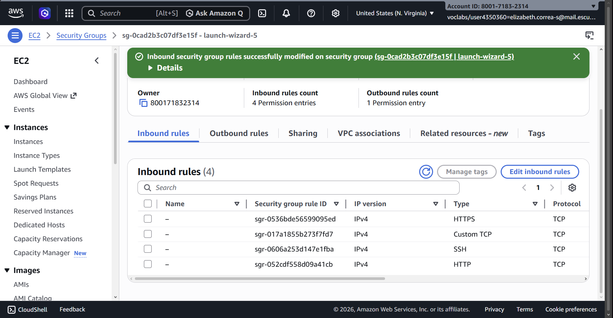

---

## Screenshots

### AWS Infrastructure

**EC2 instances running:**

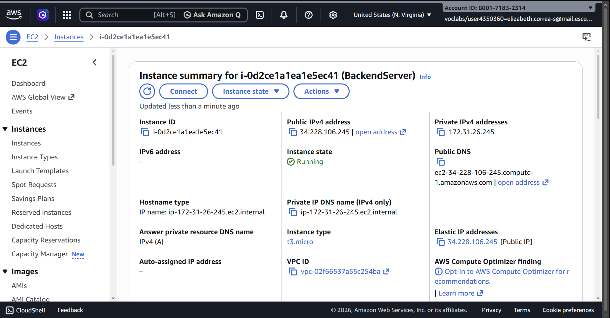

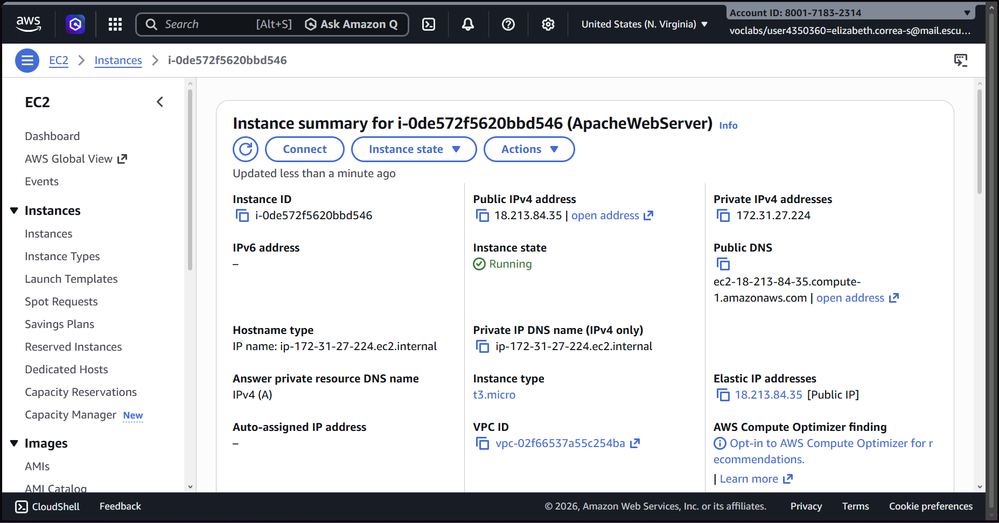

**DuckDNS domains:**

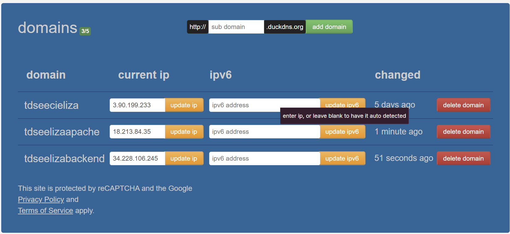

---

### TLS Certificates

**Certbot certificates on BackendServer:**

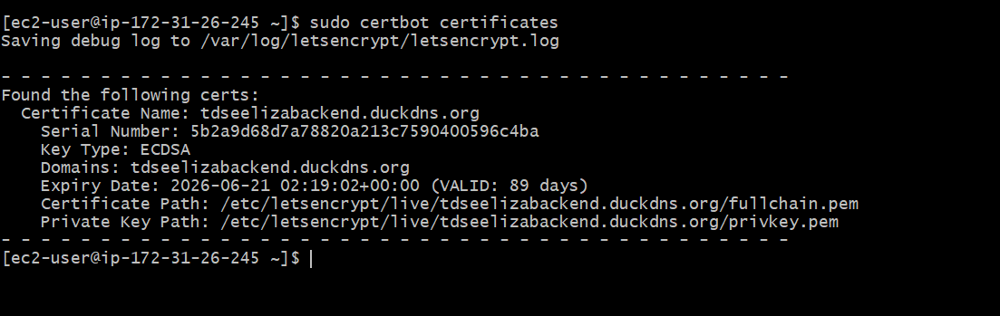

**Certbot certificates on ApacheWebServer:**

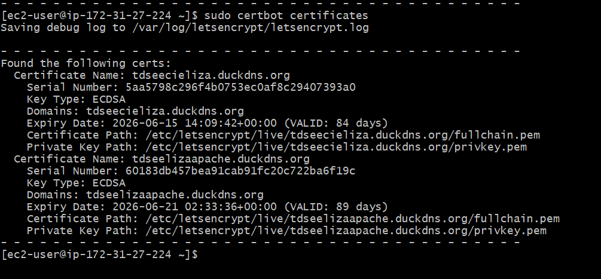

**Certificate details — Apache (browser view):**

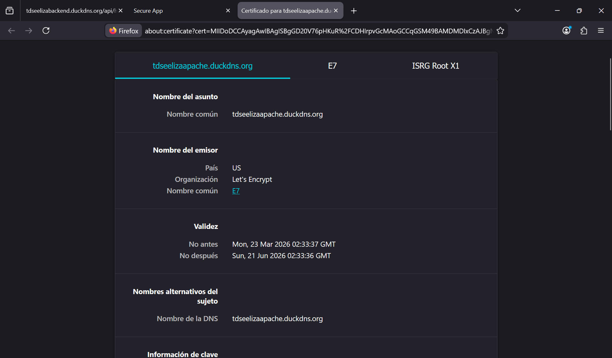

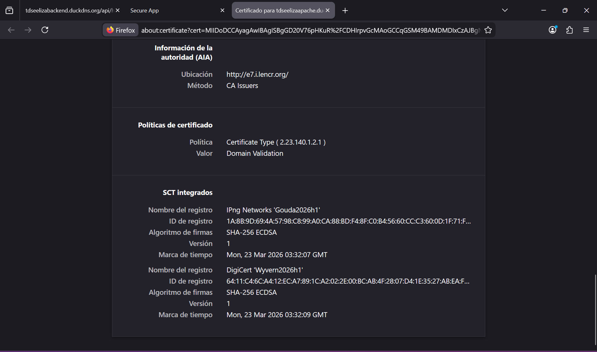

**Certificate details — Backend (browser view):**

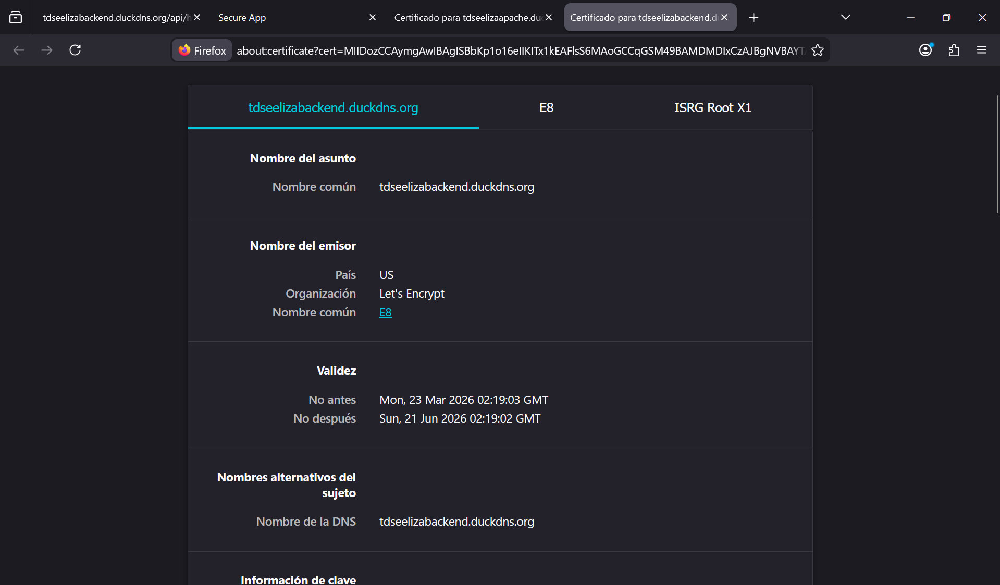

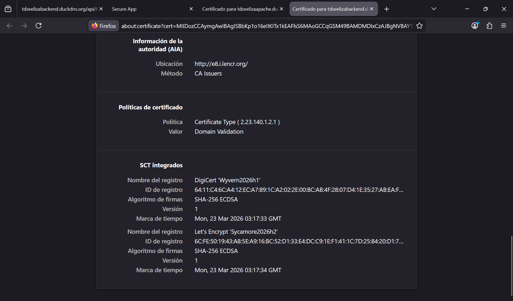

---

### Application Testing

**Frontend served over HTTPS from Apache:**

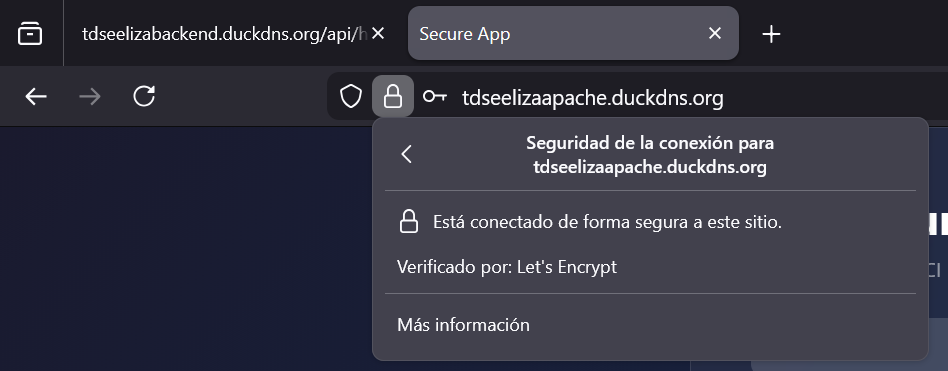

**Backend API served over HTTPS — Spring Boot:**

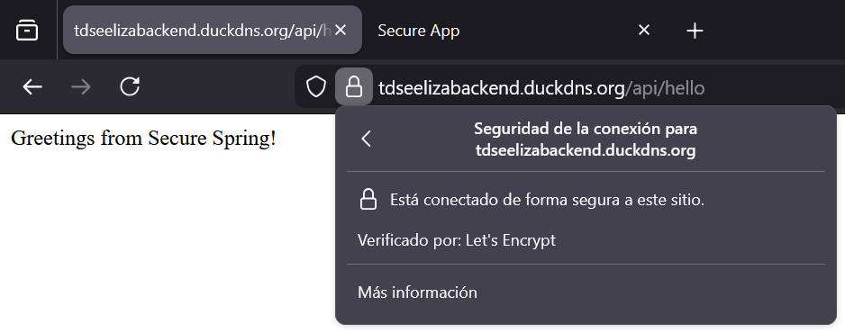

**Login form:**

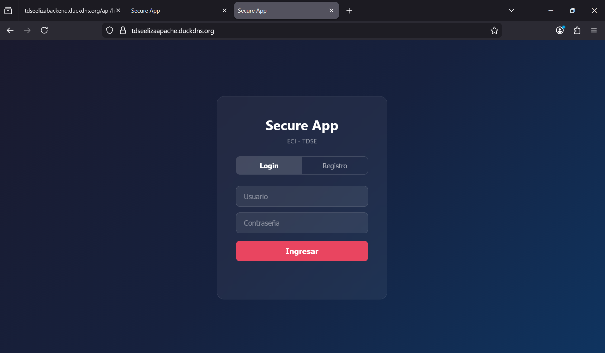

**User registration:**

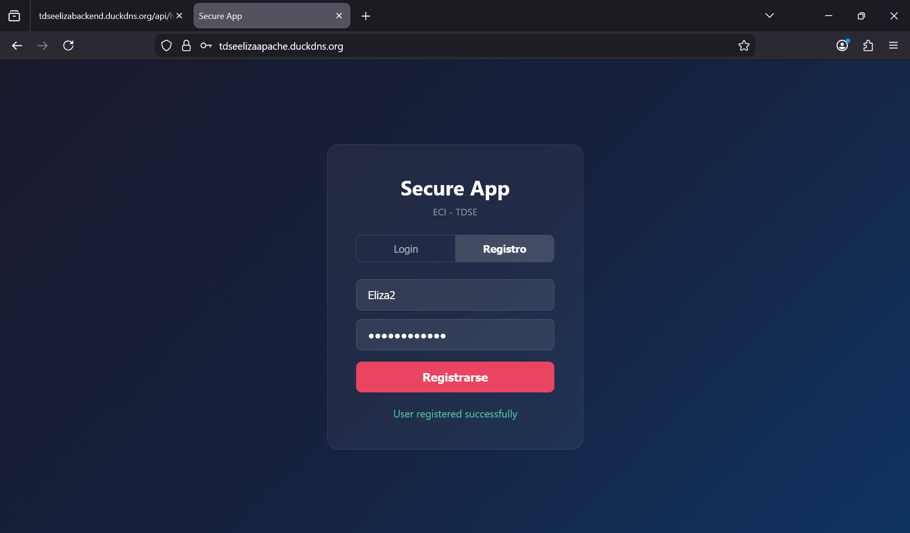

**Successful login — welcome message and Network tab showing HTTPS POST 200:**

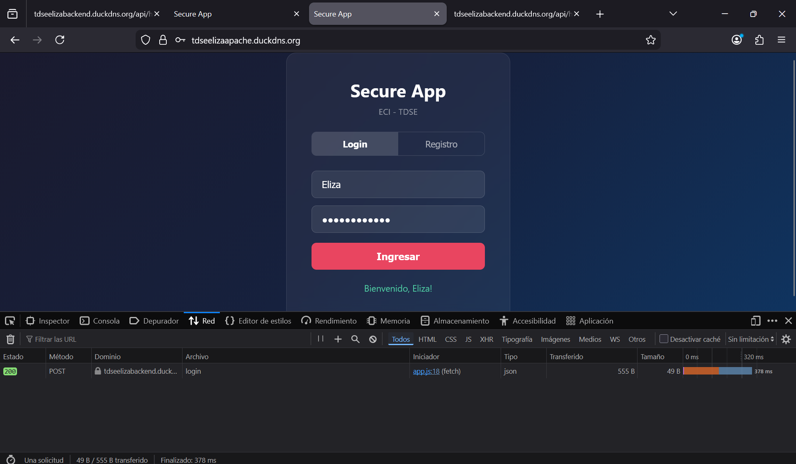

**Failed login — invalid credentials, 401 response:**

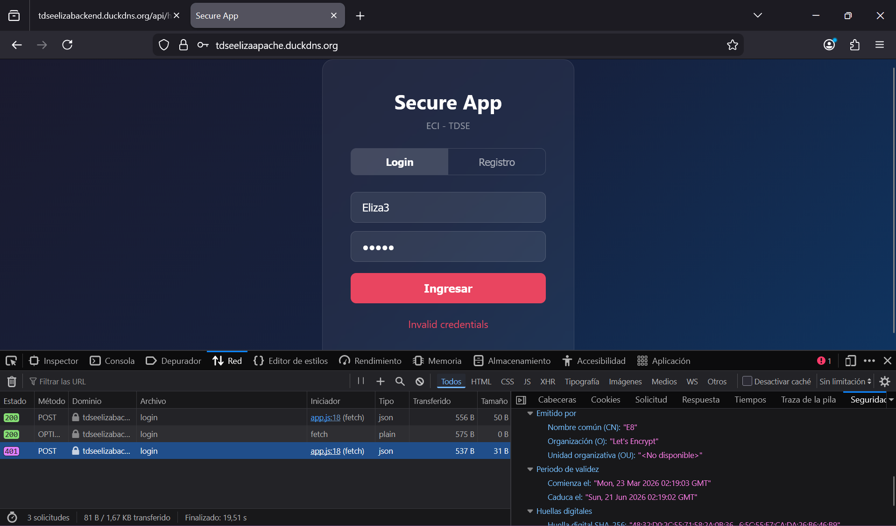

**Welcome message after login:**

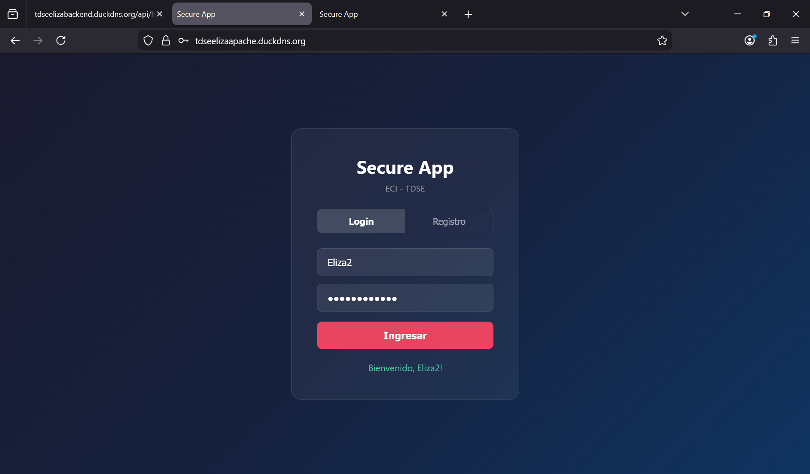

**Users table in PostgreSQL showing BCrypt hashed passwords:**

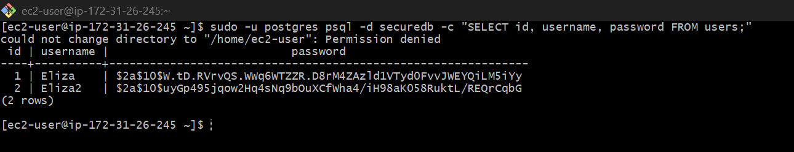

---

## API Endpoints

| Method | Endpoint | Auth required | Description |
|---|---|---|---|
| POST | /api/auth/register | No | Register a new user |
| POST | /api/auth/login | No | Authenticate and receive confirmation |
| GET | /api/hello | No | Health check |

---

## Video Demonstration

[Video_deployment](https://drive.google.com/file/d/1bPpv6k4VDY6LD6E8K0k4igJDAXgZPyhz/view?usp=sharing)

---

## Technologies Used

| Technology | Purpose |
|---|---|
| Java 21 | Backend language |
| Spring Boot 3.2 | REST API framework |
| Spring Security | Endpoint protection |
| BCrypt | Password hashing |
| Spring Data JPA + Hibernate | ORM |
| PostgreSQL 15 | Relational database |
| Apache HTTP Server | Frontend static file server |
| Let's Encrypt + Certbot | TLS certificate management |
| AWS EC2 (t3.micro) | Cloud infrastructure |
| DuckDNS | Free dynamic DNS |
| HTML + CSS + JavaScript | Frontend client |